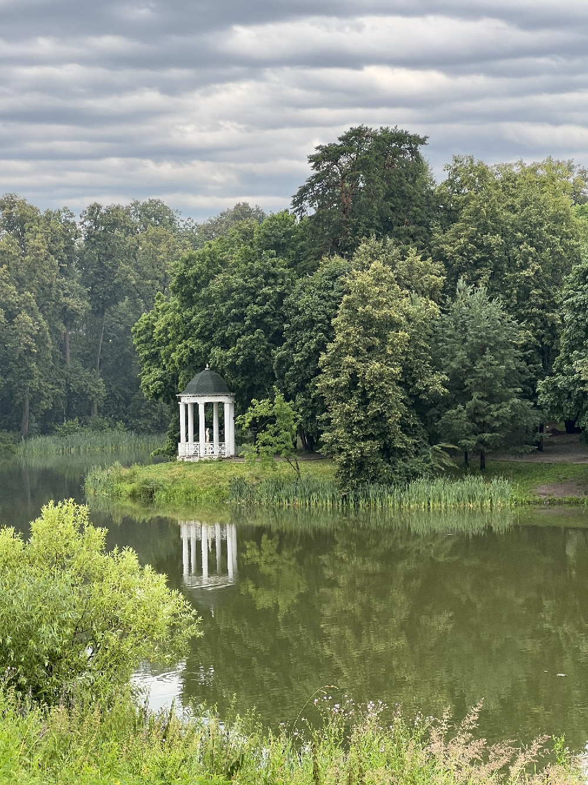
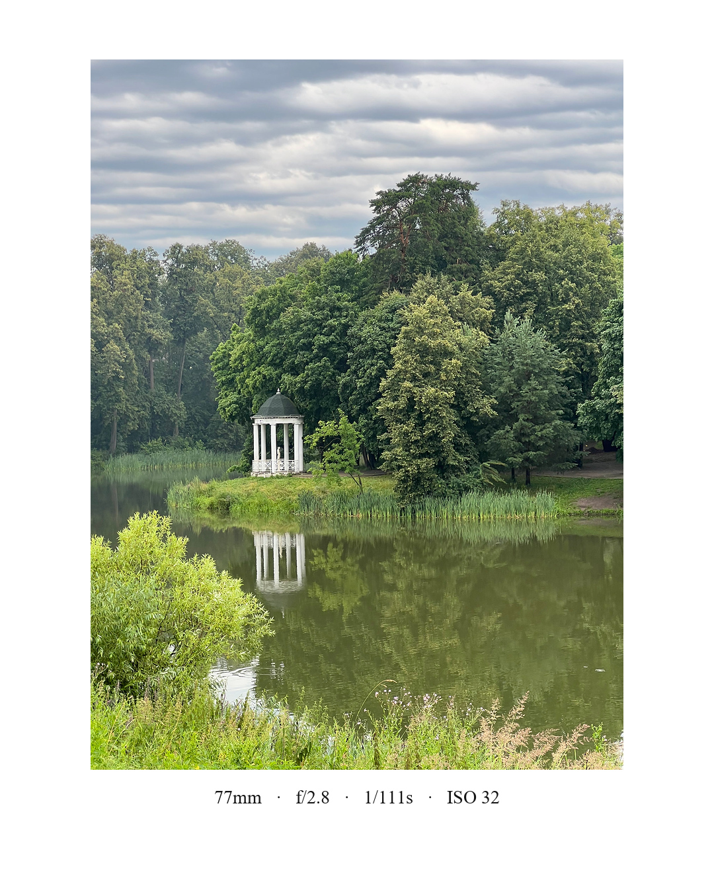

# passepartout-converter

Turns raw camera photos into Instagram-ready 1080×1350 images: the photo is placed, uncropped, on a white passe-partout canvas, with a centered caption underneath showing the shooting parameters read from EXIF (focal length, aperture, shutter speed, ISO).

Next to every export it drops a `.txt` sidecar with a ready-to-paste post — a description and hashtags written by a **local** vision LLM (Ollama in Docker, nothing leaves your machine).

| Source | Result |
| --- | --- |
|  |  |

A 3:4 iPhone shot goes in, a 1080×1350 passe-partout comes out. Nothing is cropped — the photo is scaled to fit inside the margins, and the shooting parameters are printed underneath.

This is the sidecar the model actually wrote for the photo above, with `description_language` left at its default:

```
Мирный уголок природы под тяжелым небом.

77mm   ·   f/2.8   ·   1/111s   ·   ISO 32

#landscapephotography #naturephotography #landscapelovers
#landscape #serenity #reflection
#summer #peaceful #nature
```

Set `"description_language": "English"` in `config.json` and the same photo comes back as:

```
Serene pond reflecting tranquil gazebo amidst lush greenery under cloudy sky

77mm   ·   f/2.8   ·   1/111s   ·   ISO 32

#landscapephotography #naturephotography #landscapelovers
#landscape #peaceful #summer
#reflection #architecture #nature
```

The first line of hashtags comes from `config.json`, the rest from the model. All three files are in [`examples/`](examples).

## Usage

1. Clone the repo.
2. Put your photos into **`input/`**.
3. Double-click **`src\run-all.bat`**.

That is the whole pipeline: it starts the local LLM (the first run downloads the model, about 6 GB), converts any `.heic`/`.heif` it finds, and builds the passe-partouts. You need Python with Pillow and ExifTool on PATH — see [Requirements](#requirements).

```
input/       photos waiting to be processed — this is where you drop them
processed/   <name>_passepartout.jpg + <name>_passepartout.txt
originals/   the source photo, moved here once it has been exported
src/         the scripts
config.json  prompt, description language, mandatory hashtags
```

`input/` ends up empty after a run: every photo either lands in `processed/` and moves to `originals/`, or stays put with the reason logged to `process-errors.log`.

No Docker, or Docker not running? `run-all.bat` says so and carries on without it — you still get the passe-partout, and the sidecar holds the metadata line without a description and hashtags. To turn the LLM off for good, set `SIDECAR_ENABLED = False` in the script.

The individual steps live in `src/` too, for when you need just one of them:

| | |
| --- | --- |
| `start-llm.bat` | starts Ollama and downloads the model |
| `heic2jpeg-with-metadata.bat` | converts `.heic`/`.heif` in `input/` to JPEG, keeping the metadata |
| `run-passepartout.bat` | builds the passe-partouts and the sidecars |

All of them can be run from anywhere — they resolve the project folders relative to themselves. Stop the container with `docker compose down` when you are done.

## What it does

`src/passepartout_processor.py` scans `input/` for supported images and, for each one:

1. Reads camera metadata with ExifTool.
2. Applies EXIF orientation, then converts any embedded ICC profile (Adobe RGB, Display P3, …) to sRGB.
3. Picks a layout automatically — portrait, landscape or square — so landscape shots get narrower side margins and stay large on a phone screen.
4. Fits the photo into a 1080×1350 white canvas without cropping, with gentle unsharp masking after downscaling.
5. Draws the metadata caption centered below the photo.
6. Saves a JPEG (quality 97, 4:4:4, progressive) to `processed/`, using mozjpeg's `cjpeg` if it is on PATH and falling back to Pillow otherwise. Output EXIF/GPS is stripped; the sRGB profile is kept.
7. Sends a 1024 px preview of the photo to the local LLM and writes the `.txt` sidecar.
8. Moves the original to `originals/` — only after a successful export.

Supported input: `.jpg`, `.jpeg`, `.png`, `.webp`, `.tif`, `.tiff`, `.bmp`. Failures are logged to `process-errors.log` and never abort the batch.

`heic2jpeg-with-metadata.bat` is a pre-step for iPhone photos: it converts every `.heic`/`.heif` in `input/` to JPEG with FFmpeg, copies EXIF/XMP/IPTC/ICC across with ExifTool, and moves the `.heic` originals into `originals/`. The JPEG it produces stays in `input/` and is picked up by the next step.

## The local LLM

`docker-compose.yml` runs [Ollama](https://ollama.com) with an NVIDIA GPU reserved and a `model-init` one-shot that pulls the vision model into a named volume. Photos are sent to `http://localhost:11434` over plain HTTP and never leave the machine.

The default model is `qwen2.5vl:7b` — about 6 GB, comfortable on a 12 GB card. Override it without touching the code:

```
set PASSEPARTOUT_MODEL=qwen2.5vl:3b
docker compose up -d
src\run-all.bat
```

`OLLAMA_URL` (default `http://localhost:11434`) points the script at a different host. No GPU? Delete the `deploy:` block from `docker-compose.yml` and Ollama falls back to CPU — slower, but it works.

The model is asked for a one-line description, a handful of English hashtags and the genre of the shot — see [config.json](#configjson). The answer is constrained by a JSON schema, so a chatty model cannot break the format. If the LLM is unreachable the photo is still exported — the sidecar just holds the metadata line, and the reason is printed and logged.

## config.json

Everything the LLM step reads sits in `config.json` in the project root — no need to touch the code:

```json
{
  "description_language": "Russian",

  "prompt": [
    "You are writing an Instagram caption for a photographer's shot.",
    "Look at the photo and answer with JSON only.",
    "- description: one short evocative sentence in {language} ... Maximum 90 characters.",
    "- hashtags: {min} to {max} English hashtags, lowercase, no '#' sign ...",
    "- genre: the single best match for this photo from this list: {genres} ..."
  ],

  "hashtags": {
    "always": [],
    "genres": {
      "street": ["streetphotography", "streetphoto", "urbanphotography", "citylife", "everydaylife", "streetphotographer"],
      "landscape": ["landscapephotography", "naturephotography", "landscapelovers"],
      "other": []
    }
  }
}
```

**`description_language`** — the language of the sentence above the hashtags, named in English: `Russian`, `English`, `German`. The hashtags stay English either way.

**`prompt`** — a list of lines, joined with newlines. `{language}`, `{min}`, `{max}` and `{genres}` are filled in for you; `{genres}` becomes the list of keys below. Rewrite it however you like — the answer is pinned to a JSON schema, so a chatty model still cannot break the format.

**`hashtags`** — the tags you always want, so you are not at the mercy of the model's mood. `always` goes on every photo; the model picks one key of `genres` for the shot and that set is added too. Adding a genre to the file is enough to make it selectable — the schema's enum is generated from the keys. Mandatory tags come first in the sidecar and are never dropped; the model's own tags fill the rest, up to `HASHTAGS_TOTAL_MAX` (15). Write them without the `#`.

A missing or broken `config.json` is not fatal: the built-in prompt is used, the description comes out in English and you get only the model's own tags.

## Requirements

- **Python 3.9+** with **Pillow** — `run-passepartout.bat` installs Pillow automatically if it is missing. The LLM call uses the standard library, so there is nothing else to install.
- **ExifTool** on PATH — required.
- **Docker** — only for the description and hashtags. An NVIDIA GPU with 8 GB+ makes it fast; CPU works too.
- **FFmpeg** on PATH — only for the HEIC batch file.
- **mozjpeg** (`cjpeg`) on PATH — optional; slightly better compression when present.

## Tuning

All settings live in the block at the top of `src/passepartout_processor.py`: canvas size, per-orientation margins and vertical offsets, background and text color, font size, JPEG quality, sharpening, color management. The caption font falls back through Times New Roman → Arial → Calibri → DejaVu.

---

# passepartout-converter (по-русски)

Утилита готовит фотографии к публикации в Instagram: снимок без обрезки кладётся на белое паспарту 1080×1350, а под ним по центру подписываются параметры съёмки, вытащенные из EXIF — фокусное расстояние, диафрагма, выдержка, ISO.

Рядом с каждой готовой картинкой кладётся `.txt` с готовым постом — описание и хештеги пишет **локальная** vision-модель (Ollama в докере, ничего не уходит наружу). Вот что она написала для фотографии из примера выше:

```
Мирный уголок природы под тяжелым небом.

77mm   ·   f/2.8   ·   1/111s   ·   ISO 32

#landscapephotography #naturephotography #landscapelovers
#landscape #serenity #reflection
#summer #peaceful #nature
```

Первая строка хештегов пришла из `config.json`, остальные придумала модель. Язык описания задаётся там же — поставьте `"description_language": "English"`, и тот же кадр вернётся с английским текстом.

## Как запустить

1. Склонируйте репозиторий.
2. Положите фотографии в **`input/`**.
3. Запустите **`src\run-all.bat`**.

Это и есть весь процесс: батник поднимет локальную модель (при первом запуске скачается около 6 ГБ), сконвертирует `.heic`/`.heif`, если они найдутся, и соберёт паспарту. Понадобятся Python с Pillow и ExifTool в PATH — см. [Что нужно установить](#что-нужно-установить).

```
input/       фотографии, ждущие обработки — сюда их и кладёте
processed/   <имя>_passepartout.jpg + <имя>_passepartout.txt
originals/   исходник, уехавший сюда после успешного экспорта
src/         скрипты
config.json  промпт, язык описания, обязательные хештеги
```

После прогона `input/` остаётся пустой: каждое фото либо оказывается в `processed/` и уезжает в `originals/`, либо остаётся на месте, а причина пишется в `process-errors.log`.

Нет докера или он не запущен? `run-all.bat` честно об этом скажет и продолжит без него: паспарту всё равно соберётся, а в `.txt` будет одна строка с метаданными, без описания и хештегов. Чтобы отключить модель насовсем, поставьте `SIDECAR_ENABLED = False` в скрипте.

Отдельные шаги тоже лежат в `src/` — на случай, когда нужен только один из них:

| | |
| --- | --- |
| `start-llm.bat` | поднимает Ollama и скачивает модель |
| `heic2jpeg-with-metadata.bat` | конвертирует `.heic`/`.heif` из `input/` в JPEG, сохраняя метаданные |
| `run-passepartout.bat` | собирает паспарту и `.txt` |

Запускать их можно откуда угодно — папки проекта они находят относительно себя. Когда закончите — `docker compose down` погасит контейнер.

## Как это работает

`src/passepartout_processor.py` обрабатывает все подходящие изображения из `input/`. Для каждого файла:

1. Читает метаданные камеры через ExifTool.
2. Применяет EXIF-ориентацию и переводит встроенный ICC-профиль (Adobe RGB, Display P3 и т.д.) в sRGB.
3. Сам выбирает раскладку — вертикальная, горизонтальная или квадрат. У горизонтальных кадров боковые поля уже, чтобы снимок оставался крупным на экране телефона.
4. Вписывает фото в белый холст 1080×1350 без кадрирования и аккуратно подшарпливает после уменьшения.
5. Рисует подпись с метаданными по центру под фотографией.
6. Сохраняет JPEG (качество 97, 4:4:4, progressive) в папку `processed/`. Если в PATH есть mozjpeg (`cjpeg`) — жмёт им, иначе Pillow. EXIF и GPS из результата вычищаются, профиль sRGB остаётся.
7. Отправляет превью фотографии (1024 px) в локальную модель и пишет рядом `.txt`.
8. Переносит оригинал в `originals/` — только после успешного сохранения.

Поддерживаются `.jpg`, `.jpeg`, `.png`, `.webp`, `.tif`, `.tiff`, `.bmp`. Ошибки по отдельным файлам пишутся в `process-errors.log` и не останавливают пакетную обработку.

`heic2jpeg-with-metadata.bat` — подготовительный шаг для фотографий с айфона: конвертирует все `.heic`/`.heif` из `input/` в JPEG через FFmpeg, переносит EXIF/XMP/IPTC/ICC с помощью ExifTool и убирает исходные `.heic` в `originals/`. Готовый JPEG остаётся в `input/` — его подхватит следующий шаг.

## Про локальную модель

`docker-compose.yml` поднимает [Ollama](https://ollama.com) с проброшенной видеокартой NVIDIA плюс разовый контейнер `model-init`, который скачивает vision-модель в именованный том. Фотографии уходят на `http://localhost:11434` по обычному HTTP и машину не покидают.

По умолчанию используется `qwen2.5vl:7b` — примерно 6 ГБ, спокойно живёт на 12-гигабайтной карте. Модель меняется без правки кода:

```
set PASSEPARTOUT_MODEL=qwen2.5vl:3b
docker compose up -d
src\run-all.bat
```

Переменная `OLLAMA_URL` (по умолчанию `http://localhost:11434`) нужна, если Ollama крутится на другом хосте. Нет видеокарты — уберите блок `deploy:` из `docker-compose.yml`, и модель поедет на процессоре: медленнее, но работает.

У модели просят одно предложение, несколько английских хештегов и жанр кадра — всё это настраивается в [config.json](#configjson-1). Ответ ограничен JSON-схемой, так что болтливая модель формат не сломает. Если Ollama недоступна, фотография всё равно обработается — в `.txt` останется только строка с метаданными, а причина будет напечатана и записана в лог.

## config.json

Всё, что нужно шагу с моделью, лежит в `config.json` в корне проекта — код трогать не надо:

```json
{
  "description_language": "Russian",

  "prompt": [
    "You are writing an Instagram caption for a photographer's shot.",
    "Look at the photo and answer with JSON only.",
    "- description: one short evocative sentence in {language} ... Maximum 90 characters.",
    "- hashtags: {min} to {max} English hashtags, lowercase, no '#' sign ...",
    "- genre: the single best match for this photo from this list: {genres} ..."
  ],

  "hashtags": {
    "always": [],
    "genres": {
      "street": ["streetphotography", "streetphoto", "urbanphotography", "citylife", "everydaylife", "streetphotographer"],
      "landscape": ["landscapephotography", "naturephotography", "landscapelovers"],
      "other": []
    }
  }
}
```

**`description_language`** — язык предложения над хештегами, название пишется по-английски: `Russian`, `English`, `German`. Хештеги в любом случае остаются английскими.

**`prompt`** — список строк, они склеиваются через перевод строки. `{language}`, `{min}`, `{max}` и `{genres}` подставляются сами; вместо `{genres}` уедет список ключей из блока ниже. Промпт можно переписать как угодно — ответ всё равно прибит JSON-схемой, так что формат болтливая модель не сломает.

**`hashtags`** — теги, которые нужны всегда, чтобы не зависеть от настроения модели. `always` уходит на каждое фото; жанр модель выбирает сама из ключей `genres`, и соответствующий набор тоже добавляется. Достаточно дописать жанр в файл, и он станет доступен — enum для схемы генерируется прямо из ключей. Обязательные теги идут в `.txt` первыми и никогда не выбрасываются, теги от модели дополняют список до `HASHTAGS_TOTAL_MAX` (15). Решётку писать не нужно.

Если `config.json` потерялся или сломан — не страшно: возьмётся встроенный промпт, описание получится английским, а теги будут только от модели.

## Что нужно установить

- **Python 3.9+** и **Pillow** — `run-passepartout.bat` доставит Pillow сам, если его нет. Запрос к модели идёт на стандартной библиотеке, ставить больше нечего.
- **ExifTool** в PATH — обязательно.
- **Docker** — только ради описания и хештегов. С видеокартой NVIDIA от 8 ГБ работает быстро, на процессоре тоже поедет.
- **FFmpeg** в PATH — только для батника с HEIC.
- **mozjpeg** (`cjpeg`) в PATH — по желанию, даёт чуть лучшее сжатие.

## Настройка

Все параметры собраны в блоке настроек в начале `src/passepartout_processor.py`: размер холста, поля и вертикальные сдвиги для каждой ориентации, цвет фона и текста, размер шрифта, качество JPEG, шарпинг, управление цветом. Шрифт подписи подбирается по цепочке Times New Roman → Arial → Calibri → DejaVu.
